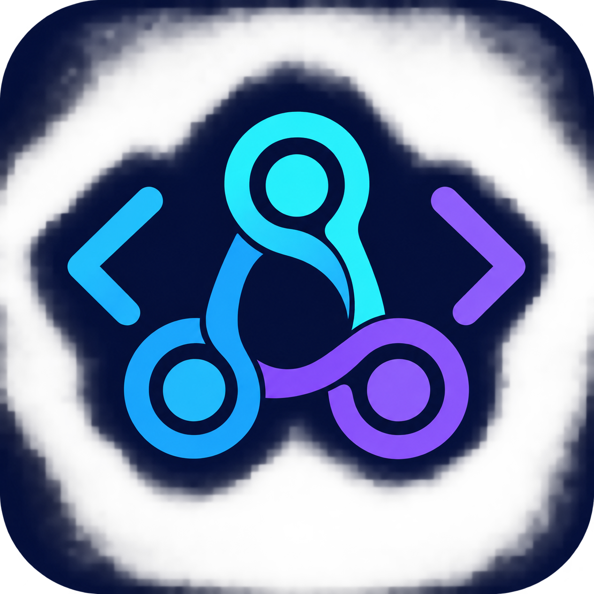

# AI Dev Orchestrator

<p align="center">
  
</p>

<p align="center">
  A local-first desktop control plane for coordinated AI-assisted software delivery.
</p>

[](https://github.com/Mandeep15686/AI-dev-orchestrator/actions/workflows/ci.yml)

AI Dev Orchestrator is a local-first desktop application for coordinating coding work across Codex, Claude Code, Cursor, and Gemini. It plans work as a task DAG, selects an available adapter, keeps Git checkpoints, and records orchestration state locally.

## What it does

- Turns a high-level engineering goal into a dependency-aware task graph.
- Routes each task to an agent based on capabilities, availability, rate limits, project language, and prior success metrics.
- Builds focused context packages from the task, Git history, local code graph, verification results, and prior handoffs.
- Runs independent work in isolated Git worktrees and merges successful work back into the project.
- Streams agent output and file-change events to the Tauri desktop UI.
- Applies build, lint, and test verification gates before work is considered complete.
- Handles recoverable failures such as timeouts, rate limits, failed tests, crashes, and requests for human input.

## How a goal runs

1. Import a local Git project and describe the goal in the desktop app.
2. `TaskPlanner` creates a master task and an ordered DAG of smaller tasks.
3. `AgentRouter` selects the best detected adapter for each ready task.
4. `ContextEngine` assembles the smallest useful context package for that agent run.
5. `DAGScheduler` dispatches independent tasks in parallel, creating Git worktrees where isolation is needed.
6. `AgentRunner` streams progress through the typed event bus while `PermissionManager` checks commands.
7. `VerificationEngine`, `HandoffEngine`, and `FailureRecovery` record the result, enforce quality gates, and determine the next action.

## Architecture

```text
Tauri + React desktop UI
          │
          ▼
TypeScript orchestration core ── Agent adapters ── Codex / Claude / Cursor / Gemini
          │
          ├── Git worktrees and checkpoints
          ├── SQLite orchestration metadata
          └── CodeGraph context queries
```

## Core subsystems

| Subsystem | Responsibility |
|---|---|
| `TaskPlanner` | Decomposes a goal into typed tasks and dependencies |
| `AgentRouter` | Scores and selects available agent adapters |
| `ContextEngine` | Produces targeted task, Git, code, and handoff context |
| `DAGScheduler` | Executes dependency-safe tasks and manages worktrees |
| `AgentRunner` | Starts, streams, stops, and records agent sessions |
| `HandoffEngine` | Converts completed sessions into structured handoffs |
| `VerificationEngine` | Runs build, lint, and test quality gates |
| `FailureRecovery` | Selects a recovery strategy for failed or interrupted work |
| `TypedEventBus` | Connects orchestration events to persistence and the UI |
| `PermissionManager` | Applies command allowlists and approval decisions |

## Agent adapters

The repository contains dedicated adapter packages for the following providers and interfaces:

| Provider | Package | Primary interface |
|---|---|---|
| Claude Code | `@ai-orch/agent-claude` | CLI |
| OpenAI Codex | `@ai-orch/agent-codex` | CLI / ACP |
| Cursor | `@ai-orch/agent-cursor` | CLI / ACP |
| Gemini | `@ai-orch/agent-gemini` | REST API |

All adapters conform to the shared `AgentAdapter` contract. This keeps detection, session lifecycle, streaming events, resumability, capability declarations, and stop behavior consistent across providers.

## Repository layout

```text
src-tauri/                 Rust Tauri application, commands, database, and icons
apps/desktop/              React desktop interface
packages/protocol/         Shared TypeScript types and event catalog
packages/core/             Planning, routing, scheduling, handoffs, and recovery
packages/agents/           Shared adapter contract and agent implementations
packages/{git,storage,
  security,codegraph}/     Supporting services
.github/workflows/ci.yml   TypeScript, Rust, and cross-platform bundle checks
```

## Quick start

Prerequisites: Node.js 20 LTS, Corepack, Rust stable with Cargo, and Git. See [SETUP.md](SETUP.md) for Windows, macOS, and Linux instructions.

```bash
git clone https://github.com/Mandeep15686/AI-dev-orchestrator.git ai-dev-orchestrator
cd ai-dev-orchestrator

corepack enable
corepack prepare pnpm@9.15.9 --activate
pnpm install --frozen-lockfile

pnpm typecheck
pnpm test
```

Start the desktop app from the repository root:

```bash
pnpm tauri
```

Build a distributable for the current operating system:

```bash
pnpm tauri:build
```

Build outputs are written under `src-tauri/target/release/bundle/`.

## Everyday commands

| Command | Purpose |
|---|---|
| `pnpm build` | Build all workspace packages in dependency order |
| `pnpm typecheck` | Run TypeScript type checks across the workspace |
| `pnpm test` | Run all workspace tests |
| `pnpm test:core` | Run the core package tests |
| `pnpm test:security` | Run the security package tests |
| `pnpm tauri` | Start Vite and the Tauri desktop application |
| `pnpm tauri:build` | Build and bundle the desktop application |

## Agent credentials

Use the app’s **Agents** page to save credentials and detect available agent CLIs. Credentials are stored through the operating system keychain; they are not written to the project database or committed to Git. Each provider may also require its own authenticated CLI or account session.

## Local state and project files

The desktop application stores orchestration metadata in local SQLite and uses the operating system keychain for credentials. When a project is initialized, it also creates a tracked `.ai-orchestrator/` directory in that project for portable orchestration state such as the task description, decisions, handoffs, and workflow state. Large run logs are excluded from source control.

## Security model

- Agent commands are checked by the permission manager before execution.
- Risky operations can require an explicit approval.
- Git checkpoints and worktrees isolate and preserve changes during orchestration.
- Local SQLite stores orchestration metadata; OS keychain storage holds credentials.
- The application is local-first: provider communication occurs through configured agent integrations rather than a hosted orchestration backend.

## Continuous integration

GitHub Actions runs on pushes to `main` and `dev`, and on pull requests to `main`. The workflow uses Node.js 20 and the repository-pinned pnpm 9.15.9, then runs:

1. Type checking and tests on Ubuntu.
2. Rust build and Clippy with warnings treated as errors on Ubuntu.
3. Tauri bundles on Ubuntu, macOS, and Windows.

The bundle jobs publish the generated artifacts from `src-tauri/target/release/bundle/`.

## Extending the project

To add an adapter, implement `AgentAdapter` (normally by extending `BaseAgentAdapter`), export it from a workspace package, and register it in `OrchestratorCore`. The adapter authoring guide is in [packages/agents/README.md](packages/agents/README.md).

## License

MIT
